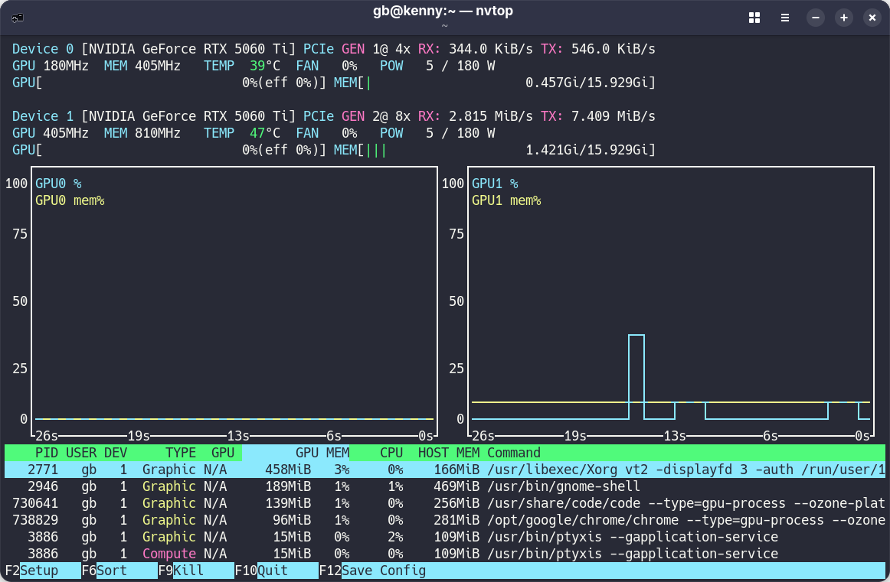

# Installation of NVIDIA Graphics Driver

This repository describes how to install the **RPM Fusion** NVIDIA Graphics Driver on **Linux Fedora 42**.

The current hardware configuration uses two of the following GPUs: **ASUS DUAL RTX 5060 Ti OC Edition 16 GB**


## ASUS DUAL RTX 5060 Ti OC Edition 16 GB

* https://www.techpowerup.com/gpu-specs/asus-dual-rtx-5060-ti-oc-edition-16-gb.b12395
* https://en.wikipedia.org/wiki/GeForce_RTX_50_series
* https://en.wikipedia.org/wiki/Blackwell_(microarchitecture)


### Identify installed GPUs

```sh
lspci | grep -e VGA
```

```text
04:00.0 VGA compatible controller: NVIDIA Corporation GB206 [GeForce RTX 5060 Ti] (rev a1)
07:00.0 VGA compatible controller: NVIDIA Corporation GB206 [GeForce RTX 5060 Ti] (rev a1)
```


## NVIDIA Graphics Driver (RPM Fusion)

* https://rpmfusion.org/Howto/NVIDIA
* https://github.com/rpmfusion


### Setup RPM Fusion Repositories

```sh
sudo dnf install https://download1.rpmfusion.org/free/fedora/rpmfusion-free-release-$(rpm -E %fedora).noarch.rpm
sudo dnf install https://download1.rpmfusion.org/nonfree/fedora/rpmfusion-nonfree-release-$(rpm -E %fedora).noarch.rpm
```


## Install akmod package for the nvidia kernel modules

```sh
sudo dnf install akmod-nvidia
```

```text
Package                             Arch    Version                             Repository                         Size
Installing:
 akmod-nvidia                       x86_64  3:580.142-2.fc42                    rpmfusion-nonfree-updates      97.7 KiB
Installing dependencies:
 egl-gbm                            i686    2:1.1.3-1.fc42                      updates                        28.5 KiB
 egl-gbm                            x86_64  2:1.1.3-1.fc42                      updates                        29.3 KiB
 egl-wayland                        i686    1.1.21-1.fc42                       updates                        82.3 KiB
 egl-wayland                        x86_64  1.1.21-1.fc42                       updates                        83.4 KiB
 egl-x11                            i686    1.0.5-1.fc42                        updates                       164.3 KiB
 egl-x11                            x86_64  1.0.5-1.fc42                        updates                       173.8 KiB
 libglvnd-opengl                    i686    1:1.7.0-7.fc42                      fedora                        132.0 KiB
 nvidia-modprobe                    x86_64  3:580.142-1.fc42                    rpmfusion-nonfree-updates      50.9 KiB
 nvidia-settings                    x86_64  3:580.142-1.fc42                    rpmfusion-nonfree-updates       4.4 MiB
 opencl-filesystem                  noarch  1.0-22.fc42                         fedora                          0.0   B
 xorg-x11-drv-nvidia                x86_64  3:580.142-1.fc42                    rpmfusion-nonfree-updates     169.4 MiB
 xorg-x11-drv-nvidia-cuda-libs      x86_64  3:580.142-1.fc42                    rpmfusion-nonfree-updates     345.6 MiB
 xorg-x11-drv-nvidia-kmodsrc        x86_64  3:580.142-1.fc42                    rpmfusion-nonfree-updates      86.8 MiB
 xorg-x11-drv-nvidia-libs           i686    3:580.142-1.fc42                    rpmfusion-nonfree-updates     175.3 MiB
 xorg-x11-drv-nvidia-libs           x86_64  3:580.142-1.fc42                    rpmfusion-nonfree-updates     443.3 MiB
 xorg-x11-drv-nvidia-xorg-libs      x86_64  3:580.142-1.fc42                    rpmfusion-nonfree-updates      19.4 MiB
Installing weak dependencies:
 xorg-x11-drv-nvidia-power          x86_64  3:580.142-1.fc42                    rpmfusion-nonfree-updates       2.3 MiB

Transaction Summary:
 Installing:        18 packages

 ...
```


## Install CUDA driver tools

```sh
sudo dnf install xorg-x11-drv-nvidia-cuda
```

```text
Package                            Arch   Version                            Repository                            Size
Installing:
 xorg-x11-drv-nvidia-cuda          x86_64 3:580.142-1.fc42                   rpmfusion-nonfree-nvidia-driver    6.3 MiB
Installing dependencies:
 nvidia-persistenced               x86_64 3:580.142-1.fc42                   rpmfusion-nonfree-nvidia-driver   54.3 KiB
 xorg-x11-drv-nvidia-cuda-libs     i686   3:580.142-1.fc42                   rpmfusion-nonfree-nvidia-driver  213.7 MiB

Transaction Summary:
 Installing:         3 packages

...
```


## Check version info for the nvidia kernel module

```sh
modinfo -F version nvidia
```

```text
580.159.03
```


## List installed nvidia-cuda packages

```sh
rpm -qa | grep nvidia-cuda | sort
```

```text
xorg-x11-drv-nvidia-cuda-580.159.03-1.fc42.x86_64
xorg-x11-drv-nvidia-cuda-libs-580.159.03-1.fc42.i686
xorg-x11-drv-nvidia-cuda-libs-580.159.03-1.fc42.x86_64
```


## List files in the CUDA driver package

```sh
rpm -ql xorg-x11-drv-nvidia-cuda-580.159.03-1.fc42.x86_64
```

```text
/usr/bin/nvidia-cuda-mps-control
/usr/bin/nvidia-cuda-mps-server
/usr/bin/nvidia-debugdump
/usr/bin/nvidia-ngx-updater
/usr/bin/nvidia-smi
/usr/share/licenses/xorg-x11-drv-nvidia-cuda
/usr/share/licenses/xorg-x11-drv-nvidia-cuda/LICENSE
/usr/share/man/man1/nvidia-cuda-mps-control.1.gz
/usr/share/man/man1/nvidia-smi.1.gz
/usr/share/nvidia/files.d
/usr/share/nvidia/files.d/sandboxutils-filelist.json
```


## List files in the CUDA libraries package

```sh
rpm -ql xorg-x11-drv-nvidia-cuda-libs-580.159.03-1.fc42.x86_64
```

```text
/etc/OpenCL/vendors/nvidia.icd
/usr/lib/modprobe.d/nvidia-uvm.conf
/usr/lib64/libcuda.so
/usr/lib64/libcuda.so.1
/usr/lib64/libcuda.so.580.159.03
/usr/lib64/libcudadebugger.so.1
/usr/lib64/libcudadebugger.so.580.159.03
/usr/lib64/libnvcuvid.so
/usr/lib64/libnvcuvid.so.1
/usr/lib64/libnvcuvid.so.580.159.03
/usr/lib64/libnvidia-encode.so
/usr/lib64/libnvidia-encode.so.1
/usr/lib64/libnvidia-encode.so.580.159.03
/usr/lib64/libnvidia-ml.so
/usr/lib64/libnvidia-ml.so.1
/usr/lib64/libnvidia-ml.so.580.159.03
/usr/lib64/libnvidia-nvvm.so
/usr/lib64/libnvidia-nvvm.so.4
/usr/lib64/libnvidia-nvvm.so.580.159.03
/usr/lib64/libnvidia-nvvm70.so.4
/usr/lib64/libnvidia-opencl.so.1
/usr/lib64/libnvidia-opencl.so.580.159.03
/usr/lib64/libnvidia-opticalflow.so.1
/usr/lib64/libnvidia-opticalflow.so.580.159.03
/usr/lib64/libnvidia-ptxjitcompiler.so.1
/usr/lib64/libnvidia-ptxjitcompiler.so.580.159.03
/usr/lib64/libnvidia-sandboxutils.so.1
/usr/lib64/libnvidia-sandboxutils.so.580.159.03
```


## Run NVIDIA System Management Interface

* https://developer.nvidia.com/system-management-interface
* https://docs.nvidia.com/deploy/nvidia-smi/index.html

```sh
nvidia-smi
```

```text
Sun Jul  5 10:45:10 2026       
+-----------------------------------------------------------------------------------------+
| NVIDIA-SMI 580.159.03             Driver Version: 580.159.03     CUDA Version: 13.0     |
+-----------------------------------------+------------------------+----------------------+
| GPU  Name                 Persistence-M | Bus-Id          Disp.A | Volatile Uncorr. ECC |
| Fan  Temp   Perf          Pwr:Usage/Cap |           Memory-Usage | GPU-Util  Compute M. |
|                                         |                        |               MIG M. |
|=========================================+========================+======================|
|   0  NVIDIA GeForce RTX 5060 Ti     Off |   00000000:04:00.0 Off |                  N/A |
|  0%   39C    P8              5W /  180W |       5MiB /  16311MiB |      0%      Default |
|                                         |                        |                  N/A |
+-----------------------------------------+------------------------+----------------------+
|   1  NVIDIA GeForce RTX 5060 Ti     Off |   00000000:07:00.0  On |                  N/A |
|  0%   47C    P5             13W /  180W |     848MiB /  16311MiB |      5%      Default |
|                                         |                        |                  N/A |
+-----------------------------------------+------------------------+----------------------+

+-----------------------------------------------------------------------------------------+
| Processes:                                                                              |
|  GPU   GI   CI              PID   Type   Process name                        GPU Memory |
|        ID   ID                                                               Usage      |
|=========================================================================================|
|    1   N/A  N/A            2771      G   /usr/libexec/Xorg                       442MiB |
|    1   N/A  N/A            2946      G   /usr/bin/gnome-shell                    145MiB |
|    1   N/A  N/A            3886    C+G   /usr/bin/ptyxis                          15MiB |
|    1   N/A  N/A          730641      G   ...rack-uuid=3190709013486085115         88MiB |
|    1   N/A  N/A          738829      G   ...rack-uuid=3190709171846157596         67MiB |
+-----------------------------------------------------------------------------------------+
```


## Install NVTOP

* https://github.com/Syllo/nvtop

```sh
sudo dnf install nvtop
```


## Run NVTOP

```sh
nvtop
```


